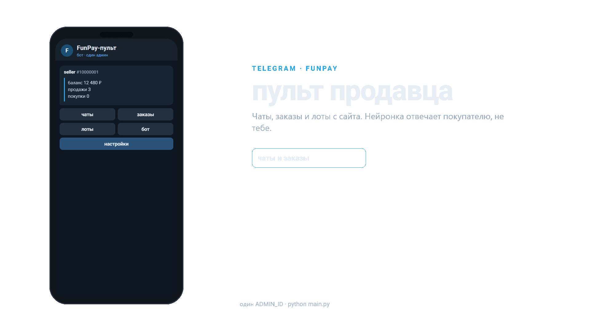

# FunPay-пульт

Telegram-админка для аккаунта [FunPay](https://funpay.com): чаты, заказы, лоты, сток, автовыдача, автоподнятие и нейронка в чатах покупателей.

FunPay **не даёт** публичный API. Бот ходит на сайт по cookie `golden_key` (библиотека FunPayAPI). Слишком частые запросы могут привести к капче, 429 и ограничениям аккаунта.

Чаты, заказы, лоты и баланс **не кэшируются** — каждый раз читаются с сайта. На диск пишутся только настройки бота, сток ключей и шаблоны ответов.



## Что умеет

- Зеркало входящих FunPay-чатов в Telegram и ответ оттуда
- Нейронка отвечает **покупателю** в FunPay, не продавцу с того же аккаунта
- Команды вроде `!вызов` — пинг в Telegram, нейронка молчит
- Автоответы по ключевым словам (`data/replies.yaml`)
- Новый заказ → выдача из стока; если сток пуст — алерт админу
- Лоты: список, вкл/выкл, цена, удаление, JSON-пачка, поднятие
- Один прокси на Telegram + FunPay + LLM
- Один админ (`ADMIN_ID`)

Главное меню — пять кнопок, дальше разделы:

| Раздел | Что внутри |
|---|---|
| чаты | список, история, ответить |
| заказы | выдать из стока, написать, возврат |
| лоты | список / сток / json / поднять |
| бот | шлюз (URL, ключ, модель) и обучение (промпт, знания, примеры) |
| настройки | прокси, команды `!…`, автоподнятие, автоответы |

## Требования

- Python 3.10+
- Telegram-бот от [@BotFather](https://t.me/BotFather)
- Аккаунт FunPay и cookie `golden_key`
- По желанию: HTTP/SOCKS5 прокси и ключ LLM-шлюза (OpenAI- или Anthropic-совместимый)

## Установка

```powershell
git clone https://github.com/ByteXk/funpay-bot.git
cd funpay-bot
python -m venv .venv
.\.venv\Scripts\Activate.ps1
pip install -r requirements.txt
copy .env.example .env
```

Заполни `.env` (файл **не** коммитится):

```
TG_TOKEN=токен_бота
ADMIN_ID=твой_telegram_id
GOLDEN_KEY=cookie_с_funpay
PHPSESSID=                 # необязательно, но стабильнее
```

`golden_key`: funpay.com → F12 → Application → Cookies → `golden_key`.  
Свой Telegram id: [@userinfobot](https://t.me/userinfobot).

Запуск:

```powershell
python main.py
```

В Telegram боту: `/start`. Должно прийти «FunPay онлайн: ник».

## Прокси

Один на всё. В `.env`:

```
PROXY_USER=
PROXY_PASS=
PROXY_IP=1.2.3.4
PROXY_PORT=1080
PROXY_TYPE=socks5
```

`PROXY_TYPE`: `socks5` / `http` / `https`. IP можно как `1.2.3.4:1080`, IPv6 — `[addr]:port`.

Или в боте: **настройки → прокси**, четыре строки: user, password, ip:port, type. Без логина первая строка `-`. Telegram подхватит прокси после перезапуска.

## Нейронка

Шлюз с OpenAI `/v1/chat/completions` и/или Anthropic `/v1/messages` (например [VarFunGateway](https://varfungateway.com/docs)).

```
LLM_URL=https://varfungateway.com/v1
LLM_KEY=sk-...
LLM_MODEL=claude-sonnet-5
LLM_PROTOCOL=auto
```

В боте: **бот → шлюз** (URL, ключ, модель, auto/openai/anthropic) и **обучение**:

- промпт — характер ответов
- знания — факты магазина (цены, правила)
- пример+ — «что пишет покупатель» / «как ответить»

Нейронка отвечает только на **свежие входящие** (около 5 минут), не на историю и не на твои сообщения с того же аккаунта.

Порядок в чате FunPay: команда `!…` → ключевое слово из yaml → нейронка (если включена).

## Команды FunPay

Покупатель пишет `!вызов` — тебе в Telegram, в FunPay уходит заготовленный ответ (если задан), нейронка не вызывается.

**настройки → команды**: добавить (первая строка — имя, дальше текст ответа) или удалить. Пока ничего не сохранял, есть дефолт `!вызов`.

## Сток и автовыдача

Ключи лежат в `data/stock/<lot_id>.txt`, по строке на единицу.

Новый заказ: бот ищет лот, снимает N строк и шлёт покупателю. Если не хватает — алерт, кнопка «выдать» в карточке заказа.

Порог «сток на исходе»: `STOCK_LOW` в `.env` (по умолчанию 3).

## JSON-лоты

**лоты → json** или просто пришли `.json` файл. Каждый элемент — отдельный лот в своей подкатегории. `amount` и `stock` независимы.

`node_id` — id **подкатегории** FunPay (число в URL раздела, не id игры). Пример: `examples/lots.json`.

```json
{
  "lots": [
    {
      "node_id": 3486,
      "title_ru": "Товар A",
      "price": 150,
      "amount": 3,
      "stock": ["key-1", "key-2", "key-3"]
    }
  ]
}
```

## Структура

```
main.py              запуск
core/                конфиг, стор, прокси, ошибки
bot/                 Telegram: хендлеры, кнопки, FSM
funpay/              сессия FunPay, лоты из JSON
models/              нейронка (OpenAI / Anthropic)
data/                настройки, сток, автоответы (не секреты аккаунта)
examples/lots.json
.env.example         шаблон, без ключей
preview.gif          баннер интерфейса
banner/              исходник гифки (HyperFrames)
```

Локально, не в git:

| Файл | Зачем |
|---|---|
| `.env` | токены и ключи |
| `data/settings.json` | прокси/LLM/промпт, как настроил в боте |
| `data/stock/*.txt` | ключи выдачи |

## Переменные `.env`

| Ключ | Смысл |
|---|---|
| `TG_TOKEN` | токен Telegram-бота |
| `ADMIN_ID` | числовой id админа |
| `GOLDEN_KEY` | cookie FunPay |
| `PHPSESSID` | сессия FunPay, необязательно |
| `USER_AGENT` | если пусто — Chrome 131 |
| `FUNPAY_DELAY` | пауза runner, сек (мин. 6 в коде) |
| `AUTO_RAISE` | `1` / `0` автоподнятие |
| `STOCK_LOW` | порог алерта стока |
| `PROXY_*` | user, pass, ip, port, type |
| `LLM_*` | url, key, model, protocol |

## Риски

Неофициальная автоматизация FunPay. Возможны 429, разлогин, ограничения. Не долби runner чаще, чем нужно. Не выкладывай `.env`, `golden_key` и сток с реальными ключами.

Премиум-эмодзи на кнопках видны, если у тебя Telegram Premium в личке с ботом. Без Premium остаются обычные подписи.

## Лицензия

Код как есть, для своего аккаунта. FunPay и Telegram — их торговые марки.
